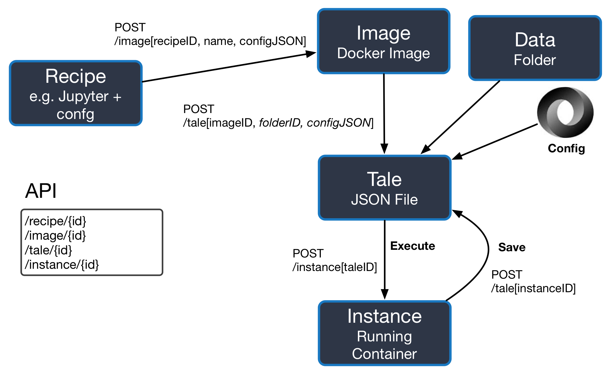

Frontend API and usage flow
===========================

Basic Architecture Diagram
--------------------------



Notes
-----

Following design plan conforms to [OpenAPI ver 2.0](http://swagger.io/specification/http://swagger.io/specification/)
specification.

Objects
-------

* common definitions

    ```yaml
    containerConfig:
        type: object
        description: Set of parameters required to instantiate a Tale
        properties:
            port:
                type: integer
            command:
                type: string
            cpuShares:
                type: string
            memLimit:
                type: string
            user:
                type: string
    containerInfo:
        type: object
        description: Set of properties of an instantiated Tale
        properties:
            created:
                type: date
            containerId:
                type: string
            mountPoint:
                type: string
    ```

* recipe

    ```yaml
    id: recipe,
    type: object,
    description: Object representing data required to build an Image.
    required:
    - _id
    - name
    - url
    - commitId
    - tag
    properties:
        _id:
            type: string
            description: unique identifier
        name:
            type: string
        description:
            type: string
        url:
            type: string
            description: >
                a URL of an external vcs repository containing all the data
                required to build an image.
        commitId:
            type: string
            description: An immutable commit identifier
        tag:
            type: string
            description: >
                A human readible identification of the Recipe.
            default: latest
        parentId:
            type: string
            description: ID of a previous version of the Recipe
    ```

* image

    ```yaml
    id: image,
    type: object,
    description: Object representing a WT Image.
    required:
    - _id
    - fullName
    - status
    - recipeId
    - digest
    - tag
    - parentId
    properties:
        _id:
            type: string
            description: internal unique identifier
        name:
            type: string
            description: A user-friendly name
        fullName:
            type: string
            description: >
                An image name following docker format:
                namespace/repository(@digest)
        description:
            type: string
        config:
            $ref: '#/definitions/containerConfig'
            description: Default container configuration.
        recipeId:
            type: string
            description: A recipe used to build the image.
        digest:
            type: string
            description: >
                Checksum of a successfully built image that can be used to
                pull a specific version of the image.
        tag:
            type: string
            description: >
                A human readible identification of the Image.
            default: latest
        parentId:
            type: string
            description: ID of a previous version of the Image
        status:
            type: string
            default: unavailable
            description: 
            enum:
            - invalid
            - unavailable
            - building
            - available
    ```

* tale

    ```yaml
    id: tale,
    type: object,
    description: Object representing a Tale.
    required:
    - _id
    - folderId
    - imageId
    properties:
        _id:
            type: string
            description: internal unique identifier
        name:
            type: string
            description: A user-friendly name
        description:
            type: string
        imageId:
            type: string
            description: ID of a WT Image used by the Tale
        folderId:
            type: string
            description: ID of a data folder used by the Tale
        config:
            $ref: '#/definitions/containerConfig'
            description: Container runtime configuration.

    ```

* instance
    
    ```yaml
    id: instance,
    type: object,
    description: Object representing a WT Instance.
    required:
    - _id
    - taleId
    - containerInfo
    - lastActivity
    - url
    - status
    properties:
        _id:
            type: string
            description: internal unique identifier
        userId:
            type: string
            description: ID of the owner
        taleId:
            type: string
            description: ID of a Tale the Instance
        containerInfo:
            $ref: '#/definitions/containerInfo'
            description: Equivalent to the ouput docker inspect
        lastActivity:
            type: date
            description: Time when the Instance was last accessed
        name:
            type: string
            description: A user-friendly name
        url:
            type: string
            description: URL allowing to access the Instance
        status:
            type: string
            default: inactive
            description: Status 
            enum:
            - starting
            - running
            - paused
            - failed
            - inactive
    ```

Implementation Notes
--------------------

API
---

Restructure the frontend creation api to use the following methods:

* /recipe - create a recipe for making an image
* /image - describes a docker image 
* /tale - combination of image, config info and data
* /instance - an instance of the resulting tale. 
